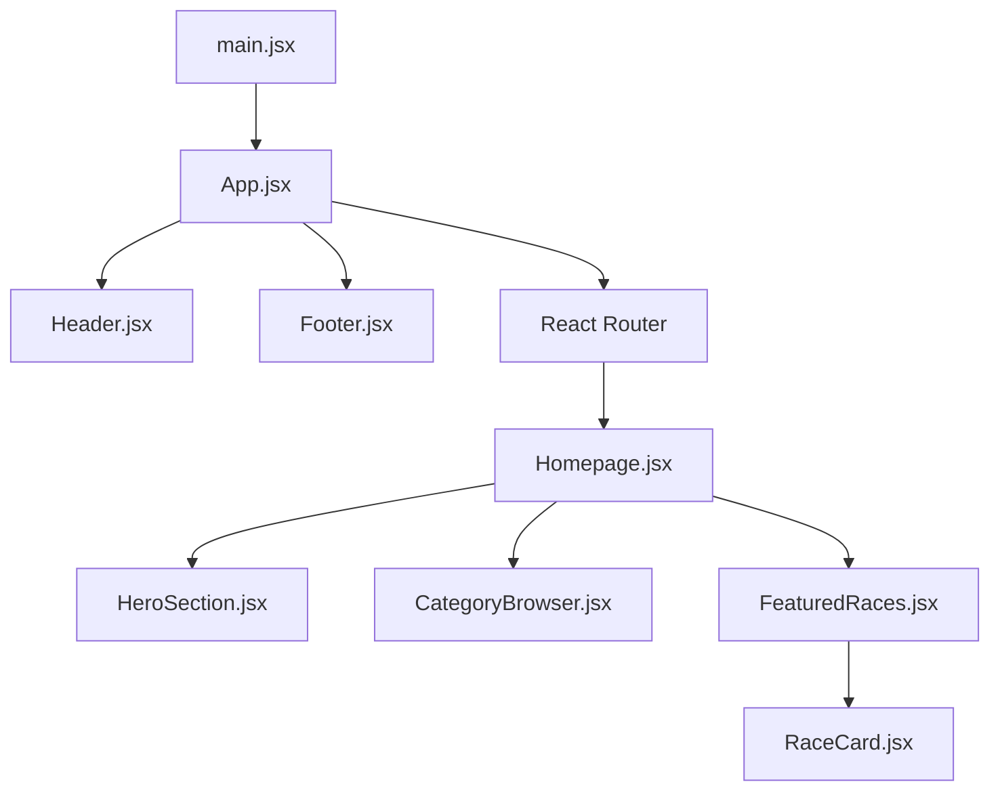

# Codebase Overview for Enduroo

## Table of Contents
1. [Introduction](#introduction)
2. [Project Structure](#project-structure)
3. [Technical Architecture](#technical-architecture)
4. [Key Components](#key-components)
5. [Dependencies and Configurations](#dependencies-and-configurations)
6. [Product Perspective](#product-perspective)

---

## Introduction
Enduroo is a React-based web application designed to help users discover and participate in running events. The project leverages modern web development tools such as Vite, TailwindCSS, and React Router for a fast and responsive user experience.

---

## Project Structure
The project is organized into the following key directories and files:

```plaintext
Enduroo/
├── public/                # Static assets
│   ├── vite.svg          # Vite logo
│   ├── Images/           # Image assets
│   └── mocks/            # Mock data (e.g., races.json)
├── src/                  # Source code
│   ├── components/       # Reusable UI components
│   ├── pages/            # Page-level components
│   ├── App.jsx           # Main layout component
│   ├── main.jsx          # Application entry point
│   └── index.css         # Global styles
├── package.json          # Project metadata and dependencies
├── vite.config.js        # Vite configuration
├── tailwind.config.js    # TailwindCSS configuration
├── postcss.config.js     # PostCSS configuration
└── README.md             # Project documentation
```

---

## Technical Architecture
The application follows a component-based architecture with React. Below is a high-level overview of the architecture:



### Key Features:
- **Routing**: React Router is used for client-side routing.
- **Styling**: TailwindCSS is used for utility-first styling.
- **State Management**: React's `useState` and `useEffect` hooks manage local state and side effects.

---

## Key Components

### 1. `App.jsx`
- Serves as the main layout for the application.
- Includes the `Header`, `Footer`, and a React Router `<Outlet>` for rendering pages.

### 2. `HeroSection.jsx`
- A visually appealing hero section with a background image and call-to-action buttons.

### 3. `CategoryBrowser.jsx`
- Displays categories of races (e.g., Marathons, Trail Running) with icons and descriptions.

### 4. `FeaturedRaces.jsx`
- Fetches and displays a list of featured races using the `RaceCard` component.

### 5. `RaceCard.jsx`
- A reusable card component for displaying race details such as title, location, and date.

---

## Dependencies and Configurations

### Dependencies
The project uses the following key dependencies:

| Dependency            | Version  | Purpose                                   |
|-----------------------|----------|-------------------------------------------|
| `react`               | ^19.1.0  | Core library for building user interfaces |
| `react-router-dom`    | ^7.6.2   | Client-side routing                       |
| `tailwindcss`         | ^4.1.10  | Utility-first CSS framework               |
| `lucide-react`        | ^0.515.0 | Icon library                              |

### Configurations

#### Vite Configuration (`vite.config.js`):
- Configures Vite to use React and TailwindCSS plugins.

#### TailwindCSS Configuration (`tailwind.config.js`):
- Specifies the content paths for purging unused styles.

#### ESLint Configuration (`eslint.config.js`):
- Enforces coding standards and best practices.

---

## Product Perspective
From a product management perspective, Enduroo aims to:

1. **Enhance User Engagement**:
   - Provide an intuitive interface for discovering running events.
   - Offer visually appealing components like the `HeroSection` and `CategoryBrowser`.

2. **Scalability**:
   - The modular architecture allows for easy addition of new features (e.g., user profiles, race registration).

3. **Localization**:
   - Currently focused on Morocco but can be extended to other regions.

4. **Future Enhancements**:
   - Add user authentication for personalized experiences.
   - Integrate APIs for real-time race updates.

---

## Conclusion
Enduroo is a well-structured and modern web application that leverages the latest web technologies to deliver a seamless user experience. Its modular architecture and clean codebase make it easy to maintain and extend.

---

*Generated on June 16, 2025.*
